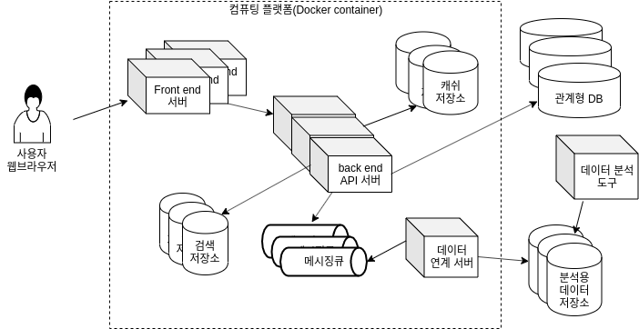

---

## 발표자 경력

- 2008 - 현재 : 네이버
   - 주로 백엔드 서버 개발 담당
   - 여러 네이버 서비스(주소록, 미투데이, 네이버TV 등)의 프로젝트 참여
   - 현재 네이버페이 기술 구조 개선 프로젝트 진행 중. 개발조직 조직장
- 2004 - 2008 : 삼성SDS
   - 공공사업 S/W 엔지니어
   - 교육부, 행자부, 감사원 프로젝트 참여
- 1997 - 2004 : 연세대학교 상경계열 재학
   - 경영학, 응용통계학 이중 전공

---

## 발표에서 다룰 주제
- 네이버의 백엔드 서버 개발자 직무 소개
- 네이버 공통 플랫폼 개발 업무 (Platform Labs) 소개
- 개발자 진로 선택 경험

---

# 백엔드 서버 개발

---

## 인터넷 서비스 구성의 예

----

## '백엔드 개발'란 어디까지인가?

- 모호하고 넓은 범위
- 어플리케이션(응용)소프트웨어 개발과 기반 플랫폼 개발
   - 경계에 걸친 일도 있음
- 데이터 엔지니어도 '백엔드 개발자' 로 넓게 분류하기도
   - 참고 : 이것도 백엔드? - [손쉽게 ML 라이프사이클을 다룰 수 있는 MLOps](https://deview.kr/2020/sessions/393)
- 사이언스보다는 엔지니어링에 가까운 일
   - 참고 : 백엔드 개발자와 협업하는 [데이터 사이언티스트 인터뷰](https://naverfincorp-career.com/nfin/interview?id=1)

---

## 주로 쓰는 기술
- 언어 : Java/JavaScript/Kotlin/Go/C++/SQL
- 기반/부품이 되는 기술: 인프라스럭 기술/미들웨어 /프레임워크
   - Linux, Docker, k8s
   - NGINX, Tomcat, Spring framework 등
- 데이터 저장소
   - 관계형 DB : MySQL이 가장 많이 쓰임
   - Key,value 저장소 : Redis, Memcached라는 오픈소스를 바탕으로 한 제품들이 많이 쓰임
   - 검색/데이터 분석 등을 위한 저장소 : 대표적으로 Hadoop 생태계 기술

---

## 첨고 자료

- [백엔드 개발자를 꿈꾸는 학생개발자에게](https://d2.naver.com/news/3435170)
- https://naver-career.gitbook.io/kr/service/platform-labs/next-npay : 실무에서 어떤 기술을 쓰는지 참고할만함
- https://www.naver-recruit.com/ : 신입공채 안내 페이지

---

# 공통 기술 플랫폼

---

### Platform Labs

- 네이버의 서비스에 쓰이는 공통 플랫폼을 개발하는 조직
- 미션 : 네이버 서비스의 기초 체력을 튼튼하게 만들어주는 기술 개발

---

### 공통 기술 플래폼의 역할은?

- 아래 서비스의 데이터는 어디에 저장될까?
   - 네이버 마이박스(구 N드라이브)에 올라간 파일
   - 네이버 메일
   - 네이버 블로그
- 수 많은 서버들을 어떻게 모니터링할까?
- 뉴스 속보로 갑자기 사용자가 몰리면 어떻게 대처할까?

---

- 네이버의 자체 공통 기술 플랫폼의 예
    - 분산 파일 시스템
    - 분산 관계형 데이터베이스
    - 모니터링 도구
    - 로그 수집 도구
    - 클라우드 컴퓨팅 플랫폼 (Docker container)
- 오픈소스 S/W를 기반으로하는 경우가 많음.
- 풀타임으로 오픈소스 개발을 하시는 분이 8명

---

## 오픈소스 기여

Platform Labs에서는 유명 오픈소스 S/W을 깊이 파악하고 기여하는 역량을 중요시하고 있음.

- 오픈소스 재단인 Apache Foundation의  committer가  6명
- 유명 오픈소스에 중요한 기여를 하기도함
   - 예) Linux 커널, Spring data
- 풀타임 오픈소스 개발자 8명

---

- Platform Labs에서 개발해서 오픈소스로 공개된 소프트웨어
   - [Pinpoint](https://github.com/pinpoint-apm/pinpoint) : 성능 모니터링 도구
   - [nGrinder](https://github.com/naver/ngrinder) : 성능 측정 도구
   - [nBase-ARC](https://github.com/naver/nbase-arc) : 분산 메모리 저장소
   - [Billboard.js](https://github.com/naver/billboard.js) : 차트 라이브러리

---

## 통계와 연관이 있는 업무

- A/B testing 플랫폼의 분석 모델
- AIOps : DevOps(개발+운영)의 AI 접목
    - 예: 현재 시스템의 상태가 장애인지 아닌지를 판단하는 모델 만들기

---

# 개발자 진로 선택

발표자의 개인적인 경험을 바탕으로..

---

## 이직

- SI업체(외주)에서 의미있는 사회경험을 했다고 느낌
- 네이버로 이직한 이유
   - 내가 쓰는 서비스를 내가 만들어보고 싶다는 생각
   - 개발자로 더 성장하고 기술역량이 더 인정 받을 수 있는 회사로 기대함

---

## 대학 시절 진로 고민
- 컴퓨터 관련 과목이 많은것이 좋아보여서 응용통계학 이중 전공 션택
- 4학년때 군대 다녀옴
   - 남다르게 할줄 아는게 프로그래밍 밖에 없어서 개발자 진로를 택함
   - 당시 비컴공전공자도 많이 뽑는 삼성SDS로 지원

---

### 재미있게 들은 과목
전체 학점은 낮은데(3.04) 컴퓨터 관련 과목은 성적이 좋았음.

- 공대 개설 교양 과목인 C/C++/Java
- 데이터베이스 (서길수 교수님)
- 시스템 설계와 분석 (김진우 교수님)
- 회귀분석 (이학배 교수님)
- 컴퓨터 자료 처리 등 박상언 교수님 과목
    - S-Plus를 배웠는데 알고보니 R과 친척
- 정보시스템 현장실습 : 홈페이지 만드는 웹에이젼시에서 인턴 체험

---

## 국민학교 - 고등학교 때

- 프로그래밍이 꾸준한 취미
    - 국민학교 때 GW-BASIC으로 입문. 고 1때 C언어 독학
- 어쩌다보니 문과 선택
    - 부모님의 권유 + 문과가 공부할 양이 적다는 감언이설에 넘어감.
- 문과로와서보니 경영학과가 그나마 맞아보임.
    - 다양한 세부 분야, 세부적인 진로 선택을 마음 편하게 유보할수 있다는 느낌.
    - 이과에 가까운 과목도 많음.

---

# 정리

---

## 요약
- 네이버 백엔드 개발/공통 플랫폼 개발은 네이버 서비스를 지탱하는 기술을 담당함.
- 프로그래밍이 스스로도 재미있고, 적성에 맞다는 증거도 있다면 개발자는 할만한 진로

---

## 덧붙임
개발/엔지니어링 역량/마음가짐은 어떤 직무를 하더라도 도움이 됨.

- 프로그래밍 언어 활용 능력
- 버전 관리 개념, 협업 시스템 사용
    - [Overleaf](https://www.overleaf.com/) 요즘 많이 쓴다고 들었음
    - 예: 오늘 발표 자료는 https://github.com/benelog/yonsei-stats/
- 지식 공유 성향
- 새로운 도구를 찾고 익히기를 즐기는 성향

----

# 질문

강의 후에 https://github.com/benelog/yonsei-stats/issues 에 하셔도 좋음
